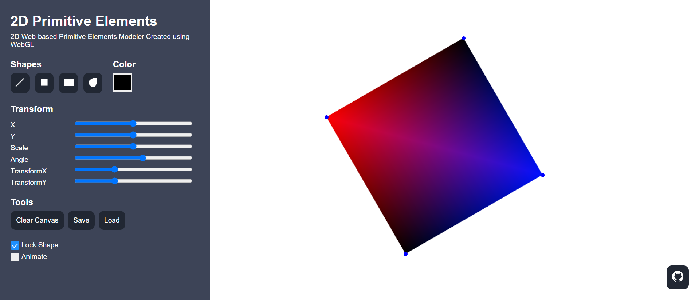
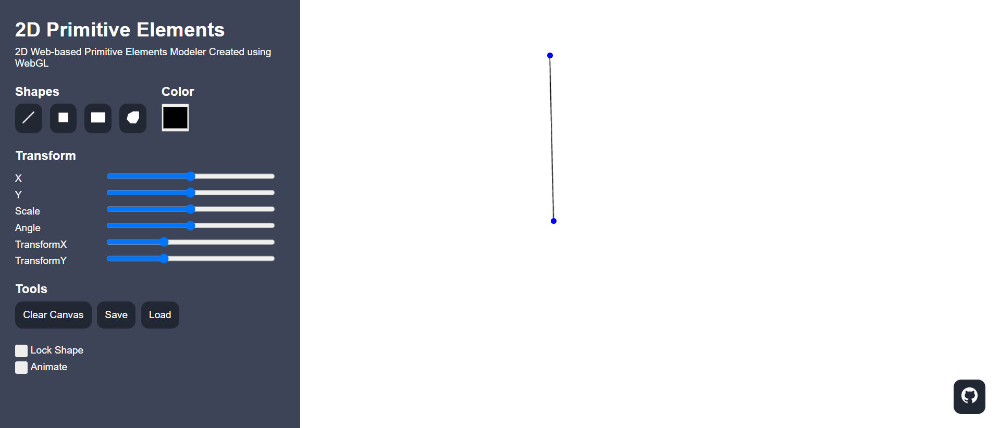
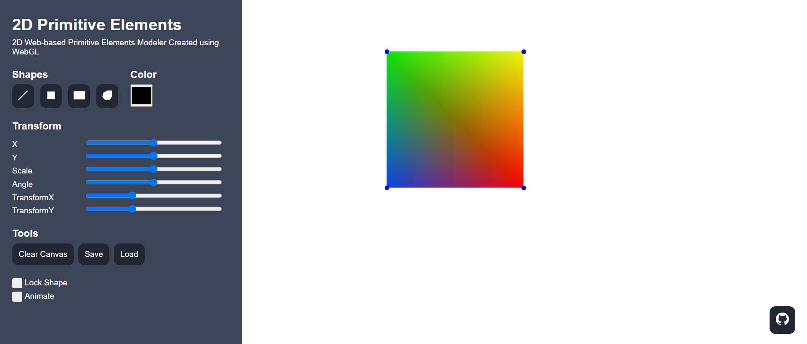
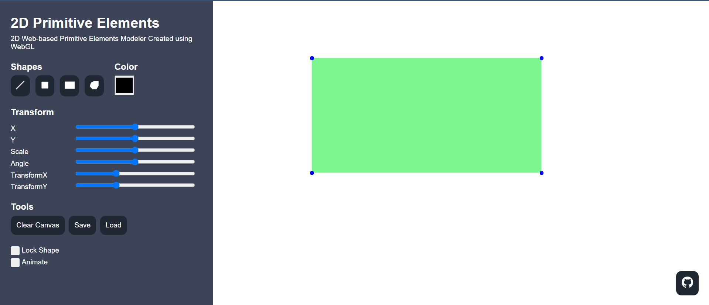
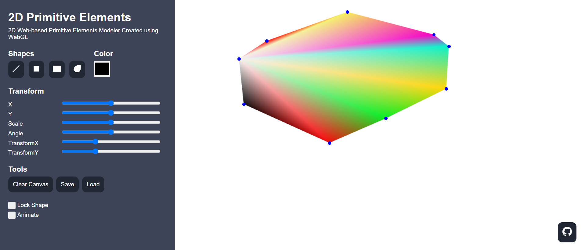

# 🟩🟣 2D Web-based Primitive Elements Modeler
> Tugas Besar 1 IF3260 Grafika Komputer - 2D Web-based Primitive Elements Modeler Created using WebGL

## 📝 Deskripsi Singkat
Aplikasi yang dibangun berhasil untuk menerapkan WebGL murni dalam pengembangan web yang memungkinkan pengguna untuk menggambar, menyunting, dan memvisualisasikan beragam model geometri pada sebuah kanvas. Hal ini mencakup pembuatan fungsi WebGL non-primitif secara independen. Program yang dibuat mengimplementasikan fungsi untuk memodifikasi model dasar seperti garis, persegi, persegi panjang, dan poligon, termasuk kapasitas untuk mengubah ukuran, menambah, atau menghapus titik pada poligon. Setiap model dapat menjalani minimal dua transformasi geometri, seperti translasi, dilatasi, rotasi, atau shear, serta mampu untuk menggerakkan titik sudut melalui *slider* atau *drag and drop*, dan mengubah warna titik-titik sudut. Aplikasi ini juga mampu untuk menyimpan dan memuat ulang model yang telah dibuat, sehingga dapat di-edit kembali. Aplikasi juga berhasil untuk mewujudkan setidaknya satu fitur lanjutan misalnya, algoritma untuk menggambar poligon yang konsisten, integrasi animasi, atau fitur penguncian untuk aspek tertentu dari model.

## ❓ Apa yang Pengguna dapat Lakukan?
<div align="center">
  
</div>
<br>
Interaksi pengguna dengan kanvas dimungkinkan melalui penggunaan berbagai peralatan yang disediakan di sisi kiri kanvas. Pengguna diberikan kebebasan untuk memilih jenis objek yang ingin mereka ciptakan, dengan opsi yang tersedia dalam bentuk tombol-tombol tertentu (misalnya tombol untuk garis, persegi, persegi panjang, dan poligon). Selain itu, fitur tambahan seperti rotasi, translasi, penskalaan, pemilihan, warna, dan penghapusan vertex membantu pengguna mengedit kreasi mereka dengan lebih lanjut. Untuk informasi lebih detil mengenai fitur-fitur ini, pengguna dapat membaca lebih lanjut pada [dokumen berikut](./docs/)

Di samping itu, kanvas dilengkapi dengan tombol untuk membersihkan area kerja serta tombol untuk mengekspor dan mengimpor file. Fungsi *load model* memungkinkan pengguna menyimpan objek-objek dari kanvas ke dalam file berformat `.json`. Adapun fungsi impor, yang didukung oleh tombol pilihan file, memungkinkan pengguna untuk memilih dan memuat file tertentu ke dalam kanvas. Proses impor dimulai dengan pembersihan kanvas untuk menghilangkan objek-objek sebelumnya, memastikan bahwa hanya model baru yang diimpor yang akan ditampilkan.

## ⚙️ Cara Menjalankan Program
*Clone* repositori ini dari terminal dengan menjalankan *command* berikut.
``` bash
$ git clone https://github.com/GAIB20/tugas-besar-grafkom-1-apa-aja.git
```
Kemudian masuk ke direktori `src` dan *double click* atau buka index.html pada browser yang mendukung WebGL *developer extension*.

## 📸 Tangkapan Layar
Berikut adalah beberapa model yang berhasil untuk dibuat.
<table style="width:100%; text-align:center;">
    <col width="49%">
    <col width="49%">
    <tr>
        <td width="1%" align="center"></td>
        <td width="1%" align="center"></td>
    </tr>
    <tr>
        <td width="1%" align="center">Model Line</td>
        <td width="1%" align="center">Model Square</td>
    </tr>
    <tr>
        <td width="1%" align="center"></td>
        <td width="1%" align="center"></td>
    </tr>
    <tr>
        <td width="1%" align="center">Model Rectangle</td>
        <td width="1%" align="center">Model Polygon</td>
    </tr>
</table>

## 👨‍👨‍👦‍👦 Pembagian Tugas
Berikut adalah pembagian tugas yang kami lakukan.
<table style="width:100%">
    <col width="70%">
    <col width="10%">
    <col width="10%">
    <col width="10%">
    <tr>
        <th>Task</th>
        <th>13521108</th>
        <th>13521127</th>
        <th>13521143</th>
    </tr>
    <tr id="merged-row">
        <td colspan="4"><b>Model dan Metode Spesialnya</b></td>
    </tr>
    <tr>
        <td>Model Garis (ubah panjang)</td>
        <td></td>
        <td></td>
        <td align="center">✅</td>
    </tr>
    <tr>
        <td>Persegi (ubah panjang sisi)</td>
        <td></td>
        <td align="center">✅</td>
        <td></td>
    </tr>
    <tr>
        <td>Persegi panjang (ubah panjang atau ubah lebar)</td>
        <td></td>
        <td align="center">✅</td>
        <td></td>
    </tr>
    <tr>
        <td>Polygon (penambahan dan penghapusan titik sudut)</td>
        <td align="center">✅</td>
        <td></td>
        <td></td>
    </tr>
    <tr id="merged-row">
        <td colspan="4"><b>Fitur Utama Model</b></td>
    </tr>
    <tr>
        <td>Transformasi geometri minimal 2 dari: translasi, dilatasi, rotasi, shear</td>
        <td align="center">✅</td>
        <td align="center">✅</td>
        <td align="center">✅</td>
    </tr>
    <tr>
        <td>Menggerakkan salah satu titik sudut dengan slider atau drag and drop</td>
        <td></td>
        <td></td>
        <td align="center">✅</td>
    </tr>
    <tr>
        <td>Mengubah warna salah satu atau semua titik sudut</td>
        <td></td>
        <td align="center">✅</td>
        <td></td>
    </tr>
    <tr>
        <td>Save dan load ulang sebuah model yang telah dibuat</td>
        <td align="center">✅</td>
        <td></td>
        <td></td>
    </tr>
    <tr id="merged-row">
        <td colspan="4"><b>Fitur Lanjutan Model</b></td>
    </tr>
    <tr>
        <td>Algoritma convex hull pada polygon</td>
        <td align="center">✅</td>
        <td></td>
        <td></td>
    </tr>
    <tr>
        <td>Integrasi animasi pada salah satu fitur yang ada</td>
        <td></td>
        <td></td>
        <td align="center">✅</td>
    </tr>
    <tr>
        <td>Fitur penguncian pada salah satu aspek</td>
        <td></td>
        <td align="center">✅</td>
        <td></td>
    </tr>
    <tr>
        <td>Menghasilkan model baru hasil irisan atau union dari 2 model</td>
        <td></td>
        <td></td>
        <td></td>
    </tr>
    <tr id="merged-row">
        <td colspan="4"><b>Lain-lain</b></td>
    </tr>
    <tr>
        <td>Tampilan Aplikasi Web</td>
        <td align="center">✅</td>
        <td></td>
        <td></td>
    </tr>
    <tr>
        <td>Setup Lingkungan WebGL</td>
        <td></td>
        <td align="center">✅</td>
        <td align="center">✅</td>
    </tr>
    <tr>
        <td>Laporan Tugas Besar</td>
        <td align="center">✅</td>
        <td align="center">✅</td>
        <td align="center">✅</td>
    </tr>
</table>

## 👏 Kontributor
|NIM|Nama Lengkap|
| :---: | --- |
| 13521108 | Michael Leon Putra Widhi |
| 13521127 | Marcel Ryan Antony |
| 13521143 | Raynard Tanadi |